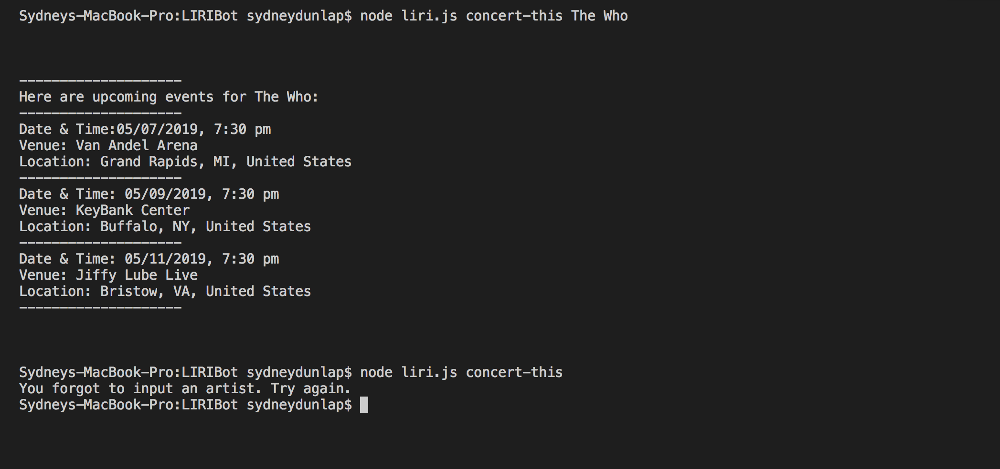

# LIRIBot Application

LIRIBot is a Language Interpretation and Recognition Interface. This is a command line node application that takes in parameters from a user and gives the user data.

## Technologies Used
- JavaScript
- Node.js
- Axios

## Project Screenshots

